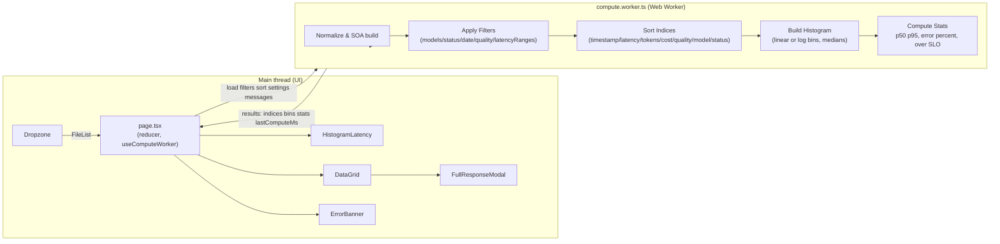

# HoneyHive Observability Dashboard

A high-performance web app for LLM Observability.

## Features

- **Interactive Latency Histogram** - Visualize response time distributions
- **Sortable Data Grid** - View and sort LLM responses timestamp, model, time, tokens, cost, quality, status
- **Advanced Filtering/Sorting** - Filter by model and bin
- **Detailed Response Modal** - Inspect full LLM outputs and metadata
- **Web Worker Processing** - Non-blocking data processing for large datasets
- **Modern UI** - Clean, accessible interface built with Tailwind CSS

## Quick Start

### Prerequisites

- Node.js 18+
- pnpm (recommended) or npm

### Installation

```bash
# Clone the repository
git clone https://github.com/chris01b/honeyhive-observability.git
cd honeyhive-observability

# Install dependencies
pnpm install

# Start development server
pnpm dev

# Open browser to http://localhost:3000
```

### Production Build

```bash
# Build for production
pnpm build

# Start production server
pnpm start
```

## Usage

- **Upload Data**: Drag and drop a JSON file containing LLM response data
- **Explore Metrics**: View the latency histogram and response statistics
- **Filter Data**: Use the controls to filter by model, latency ranges, or other criteria
- **Analyze Results**: Click on histogram bars or responses for detailed insights

### Key Components

- **`page.tsx`** - Main application container with state management
- **`DataGrid.tsx`** - Sortable table for response data
- **`HistogramLatency.tsx`** - Interactive latency visualization using Recharts
- **`useComputeWorker.tsx`** - Hook managing Web Worker communication
- **`compute.worker.ts`** - Background processing for data operations
- **`reducer.ts`** - State management logic

### Data Flow



## Key Design Decisions

After making an MVP, I decided to seperate the data from the UI with a web worker that does the heavy computational tasks (filtering, sorting, histogram generation) because large datasets can block the main thread during filtering/sorting. I then went with a reducer pattern with optimistic updates and computed state. Each UI component handles its own concerns with clear prop interfaces. TypeScript strict mode ensures runtime reliability.

### 1. Web Worker Architecture

- **Why**: Large datasets can block the main thread during filtering/sorting
- **Benefit**: UI remains responsive during heavy computations
- **Trade-off**: Slightly more complex state synchronization

### 2. Strict Type Validation

- **Why**: I don't know what your test set looks like
- **Benefit**: Graceful handling of missing/invalid fields
- **Implementation**: `parseStrict()` function with fallback values

### 3. Histogram Latency Visualization

- **Why**: Latency distribution is a most critical metric for LLM performance, and I saw it on your website
- **Benefit**: Quick identification of performance outliers and SLO violations
- **Enhancement**: Interactive selection for drill-down analysis

### 4. Custom State Management

- **Why**: Reduxfelt heavyweight for this use case
- **Benefit**: Predictable state updates with minimal boilerplate
- **Pattern**: Reducer pattern with typed actions

### 5. Optimistic Filtering

- **Why**: Immediate visual feedback improves perceived performance
- **Benefit**: Users see filter changes instantly
- **Implementation**: UI updates before worker computation completes

## Assumptions Made

1. **Data Volume**: Optimized for large datasets
2. **Data Quality**: Some fields may be missing/null, handled gracefully
3. **Browser Support**: Modern browsers with web worker support because I doubt someone building with AI is using IE
4. **File Format**: Only supported JSON support because that is the only file you provided

## Improvements for More Time

### Performance Optimizations

- **Virtual Scrolling**: For very large datasets
- **Incremental Loading**: Stream processing for massive files
- **Memoization**: More aggressive caching of computed values
- **Web Assembly**: Critical path computations in WASM

### Enhanced Analytics

- **Time Series View**: Trends over time with zoom/pan
- **Model Comparison**: Side-by-side performance analysis
- **Correlation Analysis**: Token count vs latency scatter plots
- **Anomaly Detection**: Statistical outlier identification

### User Experience

- **Dark Mode**: To match HoneyHive's existing design
- **Data Export**: CSV/JSON download of filtered results
- **Saved Filters**: Bookmark common filter combinations
- **Keyboard Shortcuts**: Power user navigation

### Monitoring & Observability

- **Error Tracking**: Integration with Sentry/DataDog
- **Performance Metrics**: Real User Monitoring (RUM)
- **A/B Testing**: Feature flag infrastructure
- **Analytics**: User behavior tracking

### Data Processing

- **Multi-file Support**: Compare multiple datasets
- **Data Validation**: Schema validation with detailed error reporting
- **Data Transformation**: Handle different input formats like CSV

## Tech Stack

- **Framework**: Next.js 15 with Turbopack
- **Runtime**: React 19 with concurrent features
- **Language**: TypeScript 5+ with strict mode
- **Styling**: Tailwind CSS 4 with modern features
- **Charts**: Recharts for responsive visualizations
- **Build**: pnpm with optimized dependency resolution

## License

This project is licensed under the MIT License - see the [LICENSE](LICENSE) file for details.
